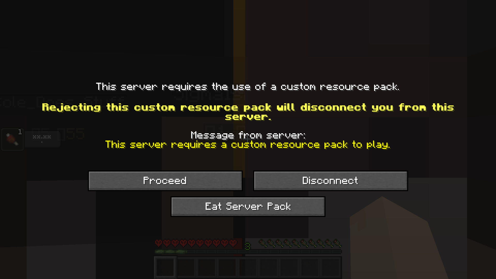

## EatServerPacks

Don't want to use a required server resource pack? Eat it!

This mod adds a new button that will silently reject a required server resource pack, then tell the server that you
accepted it when you really didn't.

**Make sure to set the pack rule on your server list to PROMPT!**

- Mod Icon made by Tiny Games.
